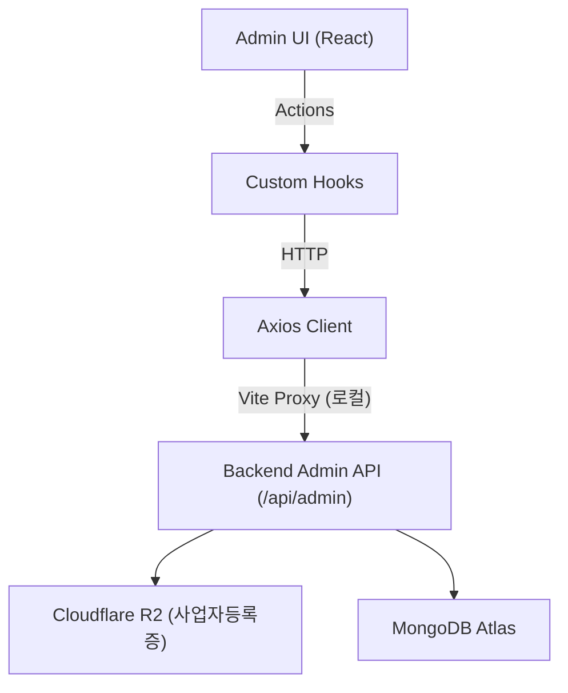

# Rusui — Admin Web

점포 라이선스 심사 및 플랫폼 전체를 관리하는 본사 관리자용 백오피스 웹 클라이언트입니다.

## Screenshots
<!-- 본사 관리자용 입점 심사 대시보드, 에러 로그 모니터링, 실시간 API 트래픽 수집 등의 스크린샷 이미지 배치 영역 -->
| 1. 입점 신청 매장 심사 | 2. 실시간 에러 대시보드 | 3. 리퀘스트 대시보드 |
| :---: | :---: | :---: |
|  |  |  |

## Tech Stack

| 항목 | 기술 |
|------|------|
| Framework | React 19 |
| Build Tool | Vite 7 |
| Router | React Router DOM 7 |
| UI Framework | Material UI (MUI) v7, Emotion |
| HTTP | Axios |
| Deployment | Vercel |

## Getting Started

```bash
npm install

# 개발 환경(Development) 구동 - 로컬 백엔드 연동
npm run dev:dev

# 운영 환경(Production) 구동 - 실서버 백엔드 연동
npm run dev:prod
```

브라우저에서 `http://localhost:5173` 으로 접근합니다.

### 환경 변수

프로젝트 루트 폴더의 환경 변수 파일(`.env.development` 및 `.env.production`)을 통해 구동 모드별 API 접속 경로를 관리합니다.

* **.env.development** (개발 환경)
  ```env
  VITE_API_BASE_URL=http://localhost:8080/api/admin
  VITE_PROXY_TARGET=http://localhost:8080
  ```
* **.env.production** (운영 환경)
  ```env
  VITE_API_BASE_URL=https://rusui-prod.fly.dev/api/admin
  VITE_PROXY_TARGET=https://rusui-prod.fly.dev
  ```

## Architecture

```
src/
├── api/            → Admin API 호출 정의 (구동 환경에 따른 Axios 인스턴스)
├── pages/          → 메인 화면 (StoreApprovalPage, ErrorCountPage, RequestCountPage, ActiveUserPage, SseStatusPage, ResponseTimePage, AuditLogPage)
├── components/     → 공통 컴포넌트 (StoreDetailModal)
├── hooks/          → 비동기 통신 상태 캡슐화 커스텀 훅
└── styles/         → MUI 글로벌 테마
```



→ 상세 구조: [`docs/implementation/architecture.ko.md`](./docs/implementation/architecture.ko.md)

## Documentation

구현 상세, 설계 결정, 트러블슈팅 기록은 [`docs/README.ko.md`](./docs/README.ko.md)를 참조하세요.
