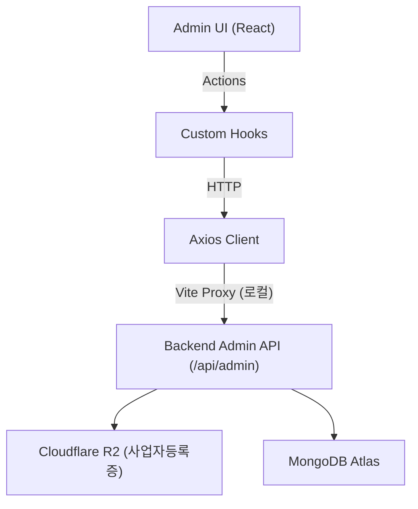

# Rusui — Admin Web

점포 라이선스 심사 및 플랫폼 전체를 관리하는 본사 관리자용 백오피스 웹 클라이언트입니다.

## Tech Stack

| 항목 | 기술 |
|------|------|
| Framework | React 19 |
| Build Tool | Vite 7 |
| Router | React Router DOM 7 |
| UI Framework | Material UI (MUI) v7, Emotion |
| HTTP | Axios |
| Deployment | Vercel |

## Getting Started

```bash
npm install
npm run dev
```

브라우저에서 `http://localhost:5173` 으로 접근합니다.

### 환경 변수

```env
VITE_PROXY_DEV_TARGET=http://localhost:8080
VITE_PROXY_PROD_TARGET=https://your-production-server.fly.dev
```

## Architecture

```
src/
├── api/            → Admin API 호출 정의 (환경별 Axios 인스턴스)
├── pages/          → 메인 화면 (StoreApprovalPage)
├── components/     → 공통 컴포넌트 (StoreDetailModal)
├── hooks/          → 비동기 통신 상태 캡슐화 커스텀 훅
└── styles/         → MUI 글로벌 테마
```



→ 상세 구조: [`docs/implementation/architecture.ko.md`](./docs/implementation/architecture.ko.md)

## Documentation

구현 상세, 설계 결정, 트러블슈팅 기록은 [`docs/README.ko.md`](./docs/README.ko.md)를 참조하세요.
