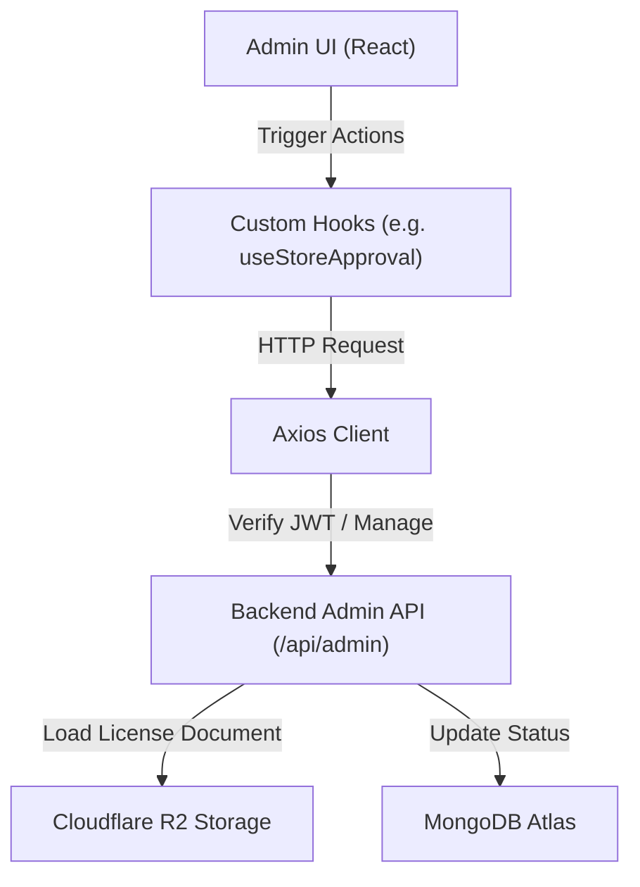

# Rusui - 통합 관리자 플랫폼 (Admin Web)

플랫폼 전체 서비스를 모니터링하고 파트너 매장의 라이선스 신청을 심사/관리하는 **Rusui** 본사 관리자용 백오피스 웹 클라이언트

## Problem
* **입점 신청 매장 심사의 비효율성:** 신규 가입한 파트너 매장이 등록한 사업자등록증 및 관련 서류를 확인하고 승인/반려 처리를 조율하는 일원화된 인터페이스가 부재하여 백오피스 운영 공수가 증가합니다.
* **유연하지 못한 화면 구성과 컴포넌트 파편화:** 다양한 해상도의 데스크톱 환경에서 다량의 신청 매장 정보를 한눈에 모니터링하기 어렵고, 컴포넌트 재사용성이 낮아 관리 기능 추가 시 코드가 비대해집니다.

## Solution
* **Material UI (MUI) v7 기반 반응형 대시보드:** 관리자 환경에 최적화된 유연한 그리드 시스템과 테마를 설계하여, 다양한 화면 크기에서도 입점 매장 목록과 승인 대기 상태를 실시간 모니터링할 수 있도록 구현했습니다.
* **모달 기반 심사 원클릭 워크플로우:** 복잡한 화면 전환 없이 대시보드 테이블 내에서 개별 매장을 클릭하면 상세 신청 정보 및 사업자 등록증 이미지를 즉시 팝업(`StoreDetailModal`) 형태로 조회하고, 즉석에서 승인/반려를 확정할 수 있는 UI 구조를 설계했습니다.

## Tech Stack
* **Frontend Core:** React 19, React Router DOM 7
* **Build Tool:** Vite 7
* **UI Framework:** Material UI (MUI) v7, Emotion
* **HTTP Client:** Axios
* **Deployment:** Vercel

## Architecture
### 1. 디렉토리 구조
```bash
src/
├── api/                  # Axios 인스턴스 및 백엔드 어드민 API 바인딩
├── assets/               # 본사 브랜딩 로고 및 고정 이미지 에셋
├── components/           # 재사용성 높은 다목적 공통 컴포넌트 (예: StoreDetailModal)
├── hooks/                # 비동기 데이터 통신 상태 격리를 위한 커스텀 훅
├── pages/                # 라우터 분기별 메인 화면 컴포넌트 (예: StoreApprovalPage)
├── styles/               # MUI 커스텀 전역 테마 및 스타일 설정
├── App.css               # 루트 컴포넌트 스타일시트
├── index.css             # 전역 기본 브라우저 스타일시트
├── App.jsx               # 라우터 설정 및 전체 레이아웃 구성
└── main.jsx              # 어플리케이션 시작점 (Entry Point)
```

### 2. 데이터 흐름 아키텍처
어드민 웹은 백엔드 코어 API 및 클라우드 스토리지와 연동되어 다음과 같이 통신합니다.


## Lessons Learned
* **MUI Custom Theme 구축을 통한 디자인 일관성 확보:** MUI v7 테마 시스템을 커스텀 튜닝하여 본사 브랜드 컬러(`AppColors`)와 타이포그래피 규칙을 전역 컴포넌트에 주입함으로써 신규 관리 컴포넌트 개발 속도를 단축했습니다.
* **커스텀 훅(Custom Hooks) 기반 API 통신 모듈화:** 비즈니스 데이터를 받아오고 처리 상태를 조작하는 Axios 통신 블록들을 React Custom Hooks로 추상화하여, 컴포넌트의 뷰(View) 역할과 비즈니스 로직(Controller) 역할을 안전하게 분리했습니다.
* **Vite 7을 활용한 빌드 파이프라인 최적화:** 초고속 로컬 HMR과 Vite 7 빌드 최적화 규칙을 도입하여 번들 크기를 최소화하고 Vercel 환경에서의 정적 웹 빌드 안정성을 극대화했습니다.

## Getting Started (시작 가이드)

### 1. 환경 변수 설정
로컬 개발 환경 구성을 위해 프로젝트 루트 디렉토리에 `.env.development` 파일을 작성합니다.

```env
# 관리자 API 백엔드 서버 주소
VITE_API_BASE_URL=YOUR_BACKEND_ADMIN_API_URL
```

### 2. 패키지 설치 및 실행
```bash
# 의존성 패키지 설치
npm install

# 로컬 개발 서버 실행 (Vite)
npm run dev
```
실행이 완료되면 터미널에 나타나는 주소(기본값: `http://localhost:5173`)로 브라우저에서 접속할 수 있습니다.
