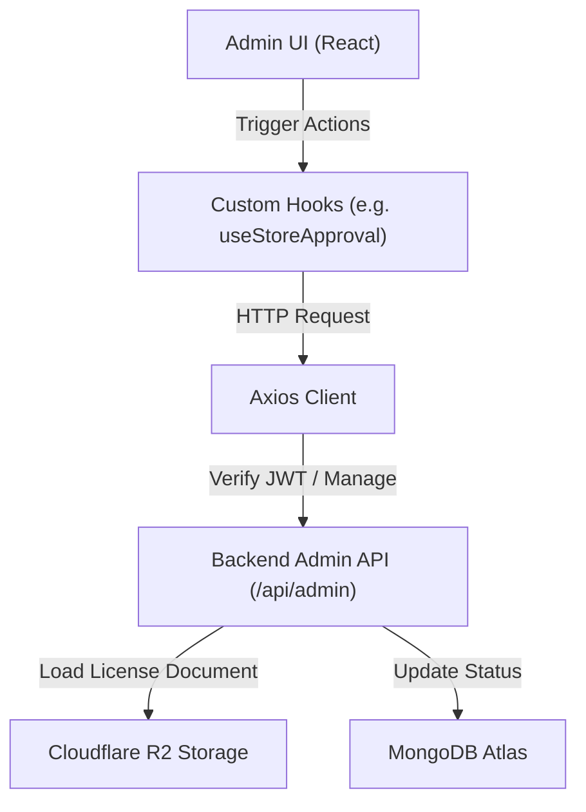

# Rusui - 統合管理者プラットフォーム（Admin Web）

プラットフォーム全体のサービスをモニタリングし、パートナー店舗のライセンス申請を審査・管理する**Rusui**本社管理者向けバックオフィスWebクライアント

## Problem
* **店舗の入店申請審査の非効率性:** 新規登録を申請したパートナー店舗が登録した事業者登録証や関連書類を確認し、承認/却下処理を調整するための一元化されたインターフェースが存在しないため、バックオフィスの運用工数が増加します。
* **柔軟性に欠ける画面構成とコンポーネントの断片化:** 様々な解像度のデスクトップ環境において、多数の申請店舗情報を一目でモニタリングすることが難しく、コンポーネントの再利用性が低いため、管理機能を追加するたびにコードが肥大化します。

## Solution
* **Material UI (MUI) v7ベースのレスポンシブダッシュボード:** 管理者環境に最適化された柔軟なグリッドシステムとカスタムテーマを設計し、多様な画面サイズでも入店申請店舗リストと承認待ちステータスをリアルタイムにモニタリングできるよう実装しました。
* **モーダルベースの審査ワンクリックワークフロー:** 複雑な画面遷移なしに、ダッシュボードのテーブル内で個別店舗をクリックするだけで、申請の詳細情報や事業者登録証画像を即座にポップアップ（`StoreDetailModal`）形式で閲覧し、その場で承認/却下を確定できるUI構造を設計しました。

## Tech Stack
* **Frontend Core:** React 19, React Router DOM 7
* **Build Tool:** Vite 7
* **UI Framework:** Material UI (MUI) v7, Emotion
* **HTTP Client:** Axios
* **Deployment:** Vercel

## Architecture
### 1. フォルダ構成
```bash
src/
├── api/                  # Axiosインスタンスおよびバックエンド管理者APIバインディング
├── assets/               # 本社ブランディングロゴおよび固定画像アセット
├── components/           # 再利用性の高い多目的共通コンポーネント（例：StoreDetailModal）
├── hooks/                # 非同期データ通信状態を隔離するためのカスタムフック
├── pages/                # ルーター分岐別のメイン画面コンポーネント（例：StoreApprovalPage）
├── styles/               # MUIカスタムグローバルテーマおよびスタイル設定
├── App.css               # ルートコンポーネントのスタイルシート
├── index.css             # グローバルな基本ブラウザスタイルシート
├── App.jsx               # ルーティング設定および全体のレイアウト構成
└── main.jsx              # アプリケーション開始点（Entry Point）
```

### 2. データフローアーキテクチャ
管理者Webは、バックエンドのコアAPIおよびクラウドストレージと連携して以下のように通信します。


## Lessons Learned
* **MUI Custom Theme構築によるデザイン一貫性の確保:** MUI v7テーマシステムをカスタムチューニングし、本社ブランドカラー（`AppColors`）とタイポグラフィ規則をグローバルコンポーネントに注入することで、新規管理コンポーネントの開発スピードを短縮しました。
* **カスタムフック（Custom Hooks）ベースのAPI通信モジュール化:** ビジネスデータを取得し処理ステータスを操作するAxios通信ブロックをReact Custom Hooksとして抽象化し、コンポーネントのビュー（View）役割とビジネスロジック（Controller）役割を安全に分離しました。
* **Vite 7を活用したビルドパイプラインの最適化:** 超高速ローカルHMRとVite 7ビルド最適化ルールを導入し、バンドルサイズを最小化してVercel環境における静的Webビルドの安定性を極大化しました。

## Getting Started（セットアップガイド）

### 1. 環境変数の設定
ローカル開発環境の構成のため、プロジェクトルートディレクトリに `.env.development` ファイルを作成します。

```env
# 管理者APIバックエンドサーバーのアドレス
VITE_API_BASE_URL=YOUR_BACKEND_ADMIN_API_URL
```

### 2. パッケージのインストールと起動
```bash
# 依存パッケージのインストール
npm install

# ローカル開発サーバーの起動 (Vite)
npm run dev
```
起動が完了すると、ターミナルに表示されるアドレス（デフォルト値：`http://localhost:5173`）からブラウザでアクセスできます。
