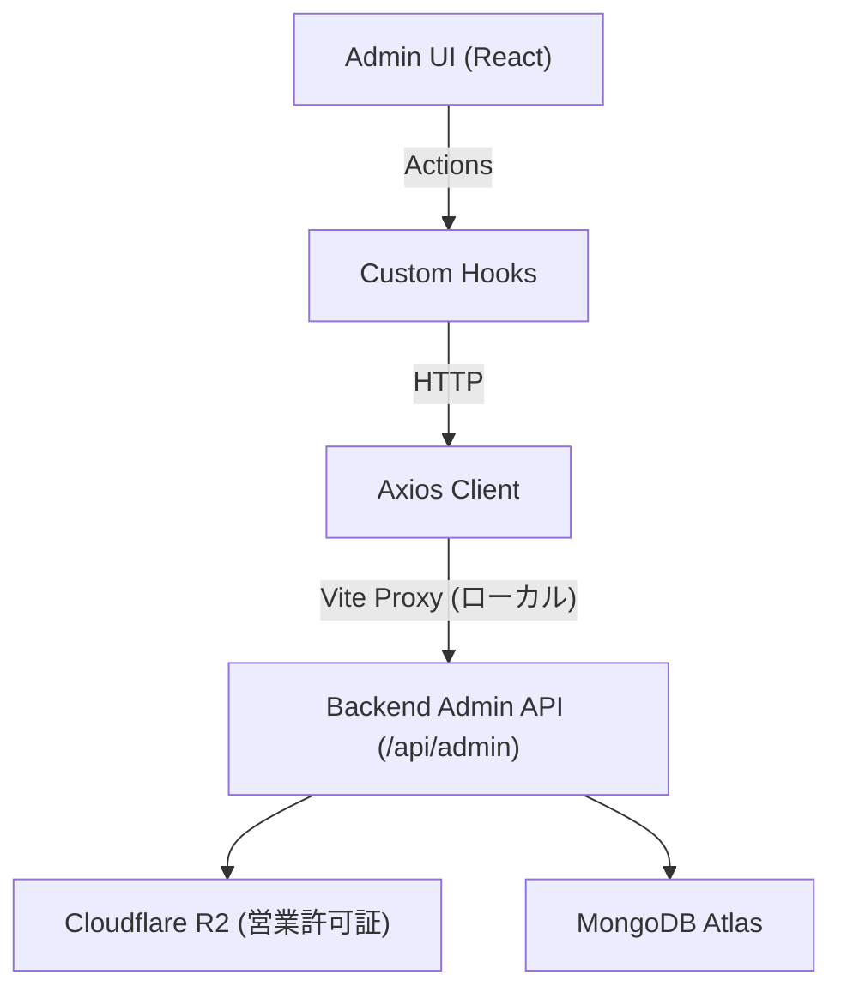

# Rusui — Admin Web

店舗ライセンス審査およびプラットフォーム全体を管理する本社管理者用バックオフィスウェブクライアントです。

## Tech Stack

| 項目 | 技術 |
|------|------|
| Framework | React 19 |
| Build Tool | Vite 7 |
| Router | React Router DOM 7 |
| UI Framework | Material UI (MUI) v7, Emotion |
| HTTP | Axios |
| Deployment | Vercel |

## Getting Started

```bash
npm install
npm run dev
```

ブラウザから `http://localhost:5173` へアクセスします。

### 環境変数

```env
VITE_PROXY_DEV_TARGET=http://localhost:8080
VITE_PROXY_PROD_TARGET=https://your-production-server.fly.dev
```

## Architecture

```
src/
├── api/            → 管理者用API呼び出し定義 (環境別のAxiosインスタンス)
├── pages/          → メイン画面 (StoreApprovalPage)
├── components/     → 共通コンポーネント (StoreDetailModal)
├── hooks/          → 非同期通信の状態をカプセル化したカスタムフック
└── styles/         → MUIグローバルテーマ
```



→ 詳細構造: [`docs/implementation/architecture.md`](./docs/implementation/architecture.md)

## Documentation

実装の詳細、設計決定、トラブルシューティングの記録は、 [`docs/`](./docs/README.md) を参照してください。
