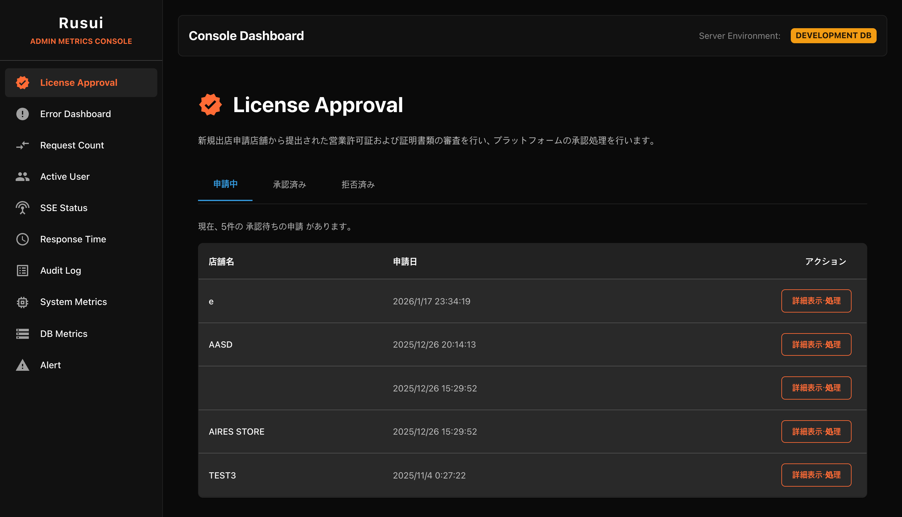
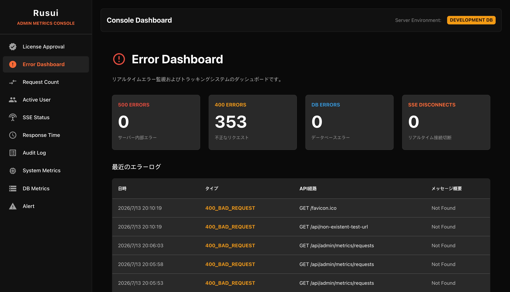
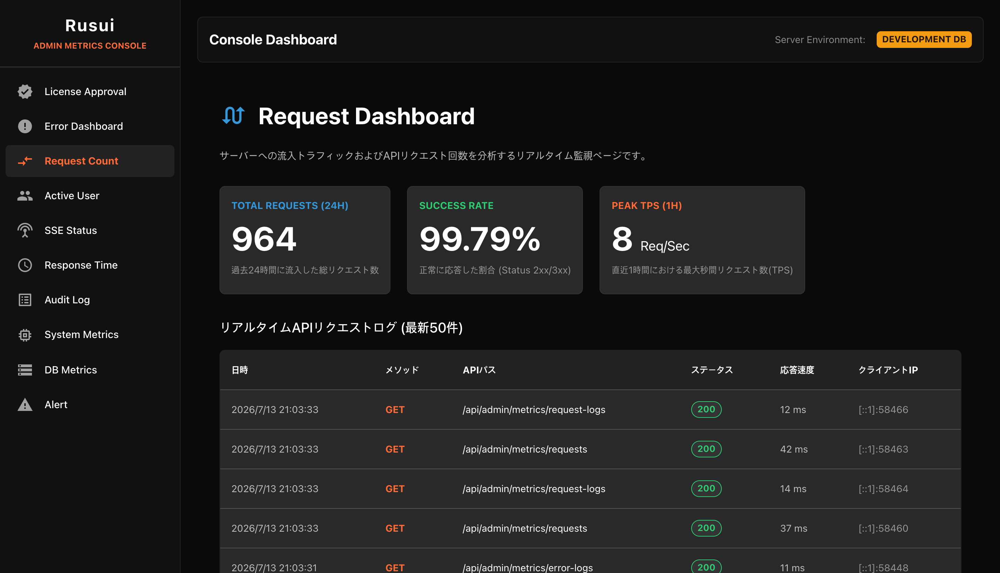
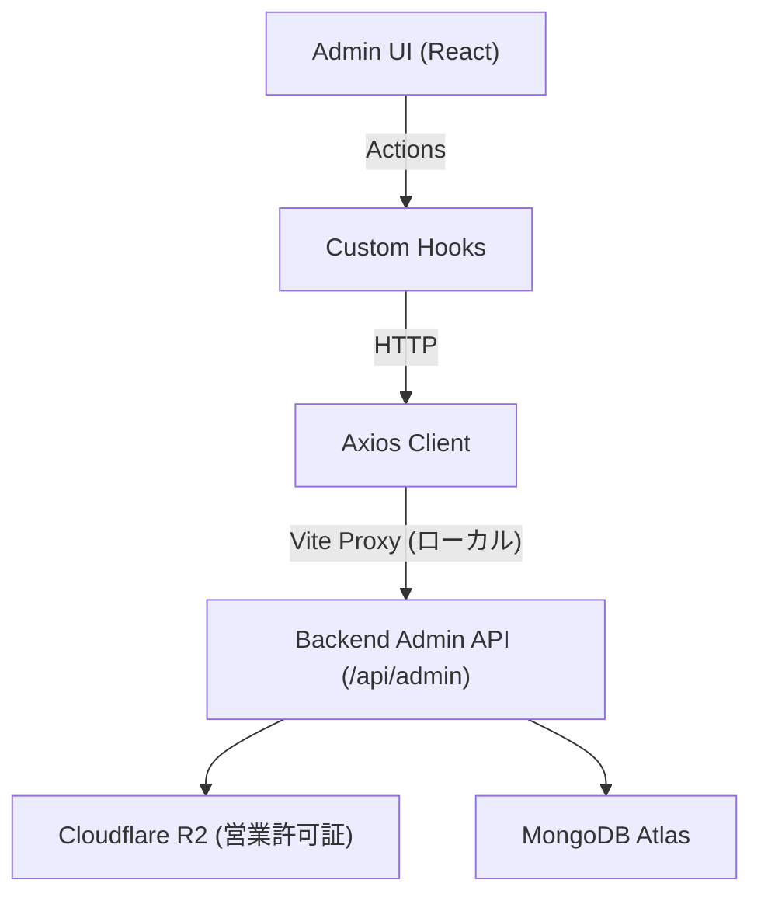

# Rusui — Admin Web

店舗ライセンス審査およびプラットフォーム全体を管理する本社管理者用バックオフィスウェブクライアントです。

## Screenshots
<!-- 本部管理者用出店審査ダッシュボード、エラーログ監視、リアルタイムAPIトラフィック収集等のスクリーンショット画像配置領域 -->
| 1. 出店申請店舗の審査 | 2. リアルタイムエラーダッシュボード | 3. リクエストダッシュボード |
| :---: | :---: | :---: |
|  |  |  |

## Tech Stack

| 項目 | 技術 |
|------|------|
| Framework | React 19 |
| Build Tool | Vite 7 |
| Router | React Router DOM 7 |
| UI Framework | Material UI (MUI) v7, Emotion |
| HTTP | Axios |
| Deployment | Vercel |

## Getting Started

```bash
npm install

# 開発環境 (Development) 起動 - ローカルバックエンド連動
npm run dev:dev

# 本番環境 (Production) 起動 - 本番バックエンド連動
npm run dev:prod
```

ブラウザから `http://localhost:5173` へアクセスします。

### 環境変数

プロジェクトルートフォルダの環境変数ファイル(`.env.development` および `.env.production`)を通じて起動モード別のAPI接続先を管理します。

* **.env.development** (開発環境)
  ```env
  VITE_API_BASE_URL=http://localhost:8080/api/admin
  VITE_PROXY_TARGET=http://localhost:8080
  ```
* **.env.production** (本番環境)
  ```env
  VITE_API_BASE_URL=https://rusui-prod.fly.dev/api/admin
  VITE_PROXY_TARGET=https://rusui-prod.fly.dev
  ```

## Architecture

```
src/
├── api/            → 管理者用API呼び出し定義 (起動環境に応じたAxiosインスタンス)
├── pages/          → メイン画面 (StoreApprovalPage, ErrorCountPage, RequestCountPage, ActiveUserPage, SseStatusPage)
├── components/     → 共通コンポーネント (StoreDetailModal)
├── hooks/          → 非同期通信の状態をカプセル化したカスタムフック
└── styles/         → MUIグローバルテーマ
```



→ 詳細構造: [`docs/implementation/architecture.md`](./docs/implementation/architecture.md)

## Documentation

実装の詳細、設計決定、トラブルシューティングの記録は、 [`docs/`](./docs/README.md) を参照してください。
