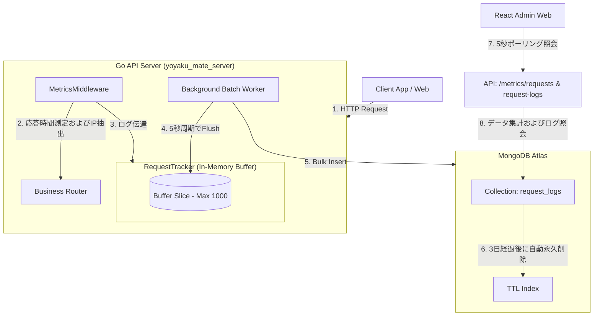

# 機能仕様書：リクエストダッシュボード (Request Dashboard)

本書は、`yoyaku_mate_admin` 本社管理者Webに実装されたリアルタイムAPIトラフィック監視システム（リクエストカウンター）の機能仕様およびシステム仕様について説明します。

---

## 1. アーキテクチャダイアグラム (System Flow)

本システムは、API呼び出しのパフォーマンスに影響を与えないよう、**非同期インメモリバッファリングおよびバッチ保存アーキテクチャ**で構成されています。

---

## 2. 画面構成要素

### 2.1 上部サマリーカード (Metrics Cards)
リアルタイムのAPIパフォーマンス状態を可視化する3つの主要指標カード。5秒周期で自動更新（HTTP Polling）されます。
- **TOTAL REQUESTS (24H)**: 過去24時間にサーバーへ流入した総HTTP APIリクエスト数。
- **SUCCESS RATE**: 24時間の総リクエストのうち、正常応答（HTTPステータスコードが2xxおよび3xx）を返した成功率(%)。エラー応答（4xx/5xx）が増加すると、リアルタイムで成功率が低下。
- **PEAK TPS (1H)**: 直近1時間で最もトラフィックが集中した瞬間の秒間最大リクエスト処理量（Transactions Per Second / Req/Sec）。

### 2.2 リアルタイムAPIリクエストログテーブル (Latest Logs Table)
直近で発生した50件のAPIリクエスト履歴を最新順にグリッド表示します。
- **表示項目**: 日時（Timestamp）、HTTPメソッド、APIパス、ステータスコード（Status Code）、応答速度（Latency）、クライアントIP。
- **視覚的強調表示（アラート）**:
  - **エラー行のハイライト**: ステータスコードが400番台（Bad Request等）の行はオレンジ色、500番台（Internal Error）の行は赤色の背景色を適用し、システム障害を即座に検知可能。
  - **遅延応答の強調表示**: APIの応答速度が500ms以上1000ms未満の場合はオレンジ色の太字、1000ms以上の場合は赤色の太字でテキストを強調し、パフォーマンス低下の原因追跡を容易化。

---

## 3. バックエンドの動作・収集メカニズム (`yoyaku_mate_server`)

### 3.1 HTTPミドルウェアとインメモリバッファリング
- **グローバル収集**: Goバックエンドサーバーのルーター前段に`MetricsMiddleware`をグローバルに適用し、流入する全APIの応答時間およびクライアントIP情報を即座にキャプチャ。
- **メモリバッファリング**: API応答への影響（レイテンシ）を避けるため、リクエストが発生するたびに同期的にDBに書き込むのではなく、`RequestTracker`内のメモリバッファ（最大1,000件の制限）に一時的に蓄積。

### 3.2 非同期バッチバルクインサートとストレージ容量管理
- **バルクバッチ処理**: バックグラウンドのGoroutineワーカーが**5秒周期**でインメモリバッファをクリアし、収集されたログをMongoDBの`request_logs`コレクションに`InsertMany`を使用してバルクインサート。
- **ディスク容量の自動制御**: 無制限のログ蓄積に伴うMongoDB Atlasのストレージ容量枯渇およびコスト高騰を防ぐため、`request_logs`コレクションの`timestamp`フィールドに**3日間（259,200秒）の有効期限（TTL）インデックス**を指定し、古いログはバックグラウンドで自動的に永久削除されるよう設計。

---

## 4. 設計選択の理由

- **バッチ保存方式の採用**: すべてのAPIリクエストごとにMongoDBへ即座に同期保存するのではなく、5秒周期のバッチ保存方式を採用。
  - **理由**: DBへの書き込み(Write)回数を減らし、メインのビジネスAPIの応答遅延(レイテンシ)を最小限に抑えるため。
  - **デメリット**: 最大5秒間ログがサーバーメモリ上のみに存在するため、サーバーの突然のダウンや障害発生時に、メモリに蓄積された一部のログが消失する可能性がある。
  - **決定**: 本機能は決済や予約情報のようにデータ整合性が必須となる機能ではなく、「運営監視およびトラフィック分析」目的であるため、システム安全性と性能確保を優先し、この程度のログ消失リスクは許容可能な範囲であると判断。

---

## 5. 今後の高度化計画 (グラフ可視化)
- **チャートライブラリの導入**: 将来的にReact管理者画面（`rusui-admin`）に`Recharts`ライブラリを追加インストールし、時間経過に伴うTPSトレンドを示す折れ線グラフ（Line Chart）や、ステータスコード別の成功/失敗比率を示すドーナツチャート（Donut Chart）の可視化機能を開発予定。

---

## 6. 関連の決定事項ドキュメント (ADR)
- [ADR-003: 独自メトリクス収集およびリクエストカウンターアーキテクチャの採用](../decisions/ADR-003-request-counter-architecture.md)
