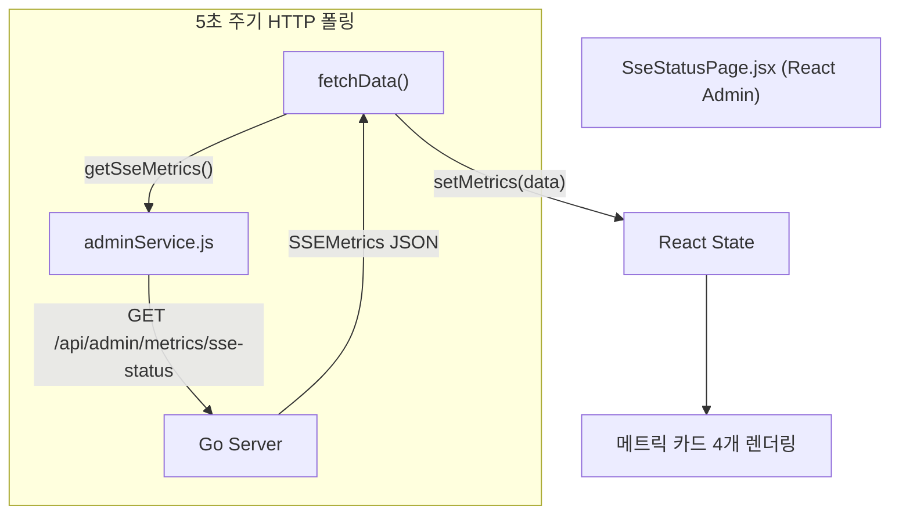

# 구현 상세서: SSE 상태 모니터링 대시보드 (SSE Status Dashboard)

본 문서는 `yoyaku_mate_admin` React 관리자 웹에서 구현된 SSE 브로커 연결 현황 모니터링 페이지의 구현 세부사항을 설명합니다.

> 작성일: 2026-07-15  
> 관련 문서: [기능 사양서: SSE 상태 모니터링 (Admin)](../features/sse-monitoring.ko.md), [구현 상세서: SSE 상태 모니터링 (서버)](../../../yoyaku_mate_server/docs/implementation/sse-monitoring.ko.md)

---

## 1. 아키텍처 및 데이터 흐름 (System Flow)

Admin 페이지는 5초 주기 HTTP 폴링으로 서버의 SSE 메트릭 엔드포인트를 호출합니다.



---

## 2. 컴포넌트 구현 상세 (`yoyaku_mate_admin`)

### 2.1 파일 구조

| 파일 | 역할 |
|------|------|
| `src/pages/SseStatusPage.jsx` | SSE 상태 페이지 컴포넌트 |
| `src/api/adminService.js` | `getSseMetrics()` API 함수 |

### 2.2 `SseStatusPage.jsx` — 폴링 및 상태 관리

`ActiveUserPage.jsx`와 동일한 5초 폴링 패턴을 적용합니다.

```jsx
const [metrics, setMetrics] = useState({
  store_broker: { active_keys: 0, total_connections: 0, avg_uptime_seconds: 0 },
  waiting_user_broker: { active_keys: 0, total_connections: 0, avg_uptime_seconds: 0 },
  total_connections: 0,
  health: 'IDLE',
});

useEffect(() => {
  fetchData();
  const interval = setInterval(fetchData, 5000); // 5초 주기 폴링
  return () => clearInterval(interval);           // 언마운트 시 정리
}, []);
```

### 2.3 업타임 포맷터 (`formatUptime`)

서버에서 받은 초 단위 숫자를 가독성 있는 형식으로 변환합니다.

| 입력 | 출력 |
|------|------|
| `0` 이하 | `-` |
| `< 60s` | `45s` |
| `< 3600s` | `5m 30s` |
| `>= 3600s` | `1h 23m` |

```js
const formatUptime = (seconds) => {
  if (seconds <= 0) return '-';
  const h = Math.floor(seconds / 3600);
  const m = Math.floor((seconds % 3600) / 60);
  const s = Math.floor(seconds % 60);
  if (h > 0) return `${h}h ${m}m`;
  if (m > 0) return `${m}m ${s}s`;
  return `${s}s`;
};
```

### 2.4 헬스 배지 (Health Chip)

`metrics.health === 'HEALTHY'` 기준으로 색상이 동적으로 변경됩니다.

```jsx
<Chip
  label={metrics.health}
  sx={{
    bgcolor: isHealthy ? COLORS.success : COLORS.textMuted,
    color: '#fff',
  }}
/>
```

---

## 3. API 함수 (`adminService.js`)

기존 메트릭 조회 패턴과 동일하게 추가되었습니다.

```js
/**
 * SSEブローカーのリアルタイム接続状況を取得します。
 * @returns {Promise<object>} SSEMetricsオブジェクト
 */
export const getSseMetrics = async () => {
  try {
    const response = await apiClient.get('/metrics/sse-status');
    return response.data?.data || response.data;
  } catch (error) {
    console.error('Error fetching SSE metrics:', error);
    throw error;
  }
};
```

* **Base URL**: 개발 환경(`DEV`) → `/api/admin` (Vite 프록시 경유), 프로덕션 → 환경변수 `VITE_API_BASE_URL`
* **에러 처리**: `catch` 블록에서 콘솔 에러 출력 후 throw → 컴포넌트 레벨에서 별도 에러 처리 가능

---

## 관련 문서
- [기능 사양서: SSE 상태 모니터링 (Admin)](../features/sse-monitoring.ko.md)
- [구현 상세서: SSE 상태 모니터링 (서버)](../../../yoyaku_mate_server/docs/implementation/sse-monitoring.ko.md)
- [기능 사양서: SSE 상태 모니터링 (서버)](../../../yoyaku_mate_server/docs/features/sse-monitoring.ko.md)
