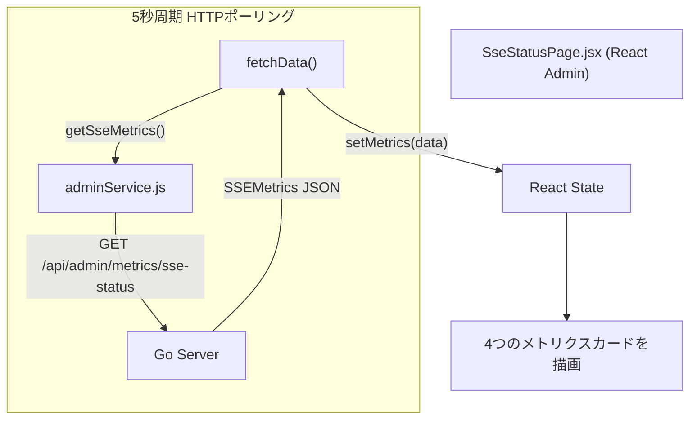

# 実装詳細書: SSE接続状態監視ダッシュボード (SSE Status Dashboard)

本ドキュメントは、 `yoyaku_mate_admin` React管理者ウェブにおいて実装されたSSEブローカー接続状況監視ページの設計・実装詳細を説明します。

> 作成日: 2026-07-15  
> 関連ドキュメント: [機能仕様書: SSE状態監視 (Admin)](../features/sse-monitoring.md), [実装詳細書: SSE状態監視 (サーバー)](../../../yoyaku_mate_server/docs/implementation/sse-monitoring.md)

---

## 1. アーキテクチャおよびデータフロー (System Flow)

Adminページは、5秒周期のHTTPポーリングによってサーバーのSSEメトリクスエンドポイントを呼び出し、情報を同期します。



---

## 2. フロントエンド実装詳細 (`yoyaku_mate_admin`)

### 2.1 ファイル構成

| ファイル名 | 役割 |
|------|------|
| `src/pages/SseStatusPage.jsx` | SSE状態監視ページコンポーネント |
| `src/api/adminService.js` | `getSseMetrics()` API呼び出し関数 |

### 2.2 `SseStatusPage.jsx` — ポーリングおよび状態管理

`ActiveUserPage.jsx` など既存のダッシュボードと同様に、5秒周期のクリーンアップ付きポーリングパターンを適用します。

```jsx
const [metrics, setMetrics] = useState({
  store_broker: { active_keys: 0, total_connections: 0, avg_uptime_seconds: 0 },
  waiting_user_broker: { active_keys: 0, total_connections: 0, avg_uptime_seconds: 0 },
  total_connections: 0,
  health: 'IDLE',
});

useEffect(() => {
  fetchData();
  const interval = setInterval(fetchData, 5000); // 5秒周期ポーリング
  return () => clearInterval(interval);           // アンマウント時にタイマークリア
}, []);
```

### 2.3 アップタイムフォーマッター (`formatUptime`)

サーバーから受信した秒単位の接続維持時間を、管理画面上で見やすい時間表記にフォーマットします。

| 入力値 | 出力値 |
|------|------|
| `0` 以下 | `-` |
| `< 60s` | `45s` |
| `< 3600s` | `5m 30s` |
| `>= 3600s` | `1h 23m` |

```js
const formatUptime = (seconds) => {
  if (seconds <= 0) return '-';
  const h = Math.floor(seconds / 3600);
  const m = Math.floor((seconds % 3600) / 60);
  const s = Math.floor(seconds % 60);
  if (h > 0) return `${h}h ${m}m`;
  if (m > 0) return `${m}m ${s}s`;
  return `${s}s`;
};
```

### 2.4 ヘルスバッジ (Health Chip)

`metrics.health === 'HEALTHY'` の真偽値に基づき、チップの色を動的に変更します。

```jsx
<Chip
  label={metrics.health}
  sx={{
    bgcolor: isHealthy ? COLORS.success : COLORS.textMuted,
    color: '#fff',
  }}
/>
```

---

## 3. API関数 (`adminService.js`)

既存のシステム監視メトリクス取得APIと同様の認証・Axiosクライアント定義を継承して実装しました。

```js
/**
 * SSEブローカーのリアルタイム接続状況を取得します。
 * @returns {Promise<object>} SSEMetricsオブジェクト
 */
export const getSseMetrics = async () => {
  try {
    const response = await apiClient.get('/metrics/sse-status');
    return response.data?.data || response.data;
  } catch (error) {
    console.error('Error fetching SSE metrics:', error);
    throw error;
  }
};
```

* **Base URL**: 開発環境（`DEV`） → `/api/admin` (Vite開発サーバーのプロキシが介入しルーティングされます)、本番環境（`PROD`） → 環境変数 `VITE_API_BASE_URL` で設定されたオリジンに直通します。
* **エラー処理**: 接続エラー時はコンソールにログを記録し呼び出し元にエラーをthrowします。画面上のエラーフォールバック表示などにフック可能です。

---

## 関連ドキュメント
- [機能仕様書: SSE状態監視 (Admin)](../features/sse-monitoring.md)
- [実装詳細書: SSE状態監視 (サーバー)](../../../yoyaku_mate_server/docs/implementation/sse-monitoring.md)
- [技術決定(ADR): SSE監視ダッシュボードにおける通信の分離](../../../yoyaku_mate_server/docs/decisions/ADR-006-sse-monitoring-polling.md)
